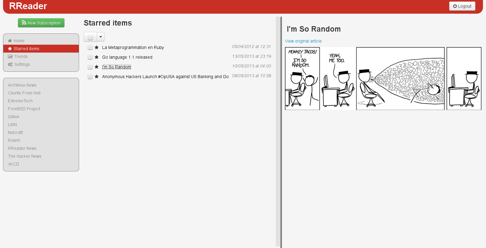

# README

## SYNOPSIS

**RReader** is a RSS/Atom feed reader written as a web application in Ruby on
Rails.

While still being in development, it already boasts all basic features you would
expect from a RSS feed reader. It is meant to be self-hosted and is fully Ajax.
The latter means that the web page never needs to be refreshed.

## TESTING THE APPLICATION

You need Ruby 1.9.3. Ideally, you should use `rvm` to manage your ruby version.

Once you have cloned this repository, execute the following commands from the
root's directory:

    bundle install
    rake db:migrate

You can then launch Rails `webrick` server by issuing the following command:

    rails s

You can then navigate to http://localhost:3000/users/sign\_up to register for a
user and login once done. You can then add subscriptions and play around.
Remember though that this application is currently still in early development
stage.

## CONTRIBUTING

Contributions are welcome. If you intend to contribute more that a simple patch,
you should register to the official website:
http://projects.gw-computing.net/projects/rreader

## SCREENSHOTS

